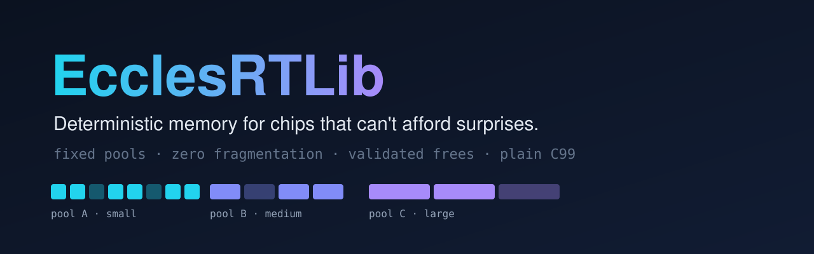

<div align="center">



<br>

[](https://github.com/igwe-starking/eccles-rtmem/actions/workflows/ci.yml)
[](LICENSE)
[](#)
[](#)
[](https://github.com/sponsors/igwe-starking)

### `malloc()` works great — until hour 300, when your device quietly dies.

**EcclesRTLib** is a plain-C fixed-pool allocator for microcontrollers.
Same `malloc`/`free` shape. No heap fragmentation. No surprises.

<sub>Part of the **EcclesRTLib** family of embedded runtime libraries. This repo is the **RuntimeMemory** module (`eccles-rtmem`).</sub>

[**Quick start**](#-quick-start-30-seconds) · [**Platforms**](#-runs-where-you-do) · [**How it works**](#-how-it-works) · [**Docs**](docs/DESIGN.md) · [**Sponsor**](#-support-the-project)

</div>

---

## 😱 The bug you can't reproduce

Your firmware passes every bench test. Then it ships. Somewhere around day 12, a radio frame arrives and `malloc(96)` returns `NULL` — even though the heap reports **plenty of free memory**. It's just chopped into pieces too small to use.

That's heap fragmentation. On a desktop it's a rounding error. On a chip with 2 KB of RAM it's a **field failure you'll never see in a debugger.**

EcclesRTLib removes the failure mode instead of tuning around it:

- 🧱 **Memory is carved into fixed-size blocks up front.** Allocate, free, allocate again — the layout never degrades.
- 🔒 **The lock is picked for you.** FreeRTOS, Zephyr, CMSIS-RTOS2, Pico SDK (dual-core safe), AVR, MSP430, Cortex-M… detected at compile time.
- 🛡️ **Bad frees can't corrupt anything.** Double free, wild pointer, pointer into the middle of a buffer — all rejected *and told to you*, by name.
- 🧪 **Tested like it matters.** Randomized stress with per-buffer canary bytes, across 8 configurations, clean under AddressSanitizer and UBSan.

## ⚡ Quick start (30 seconds)

Drop in `src/eccles_rtmem.c` and `src/eccles_rtmem.h`, then:

```c
#include "eccles_rtmem.h"

void setup(void) {
    eccles_rtmem_init();                    // once, at boot
}

void on_radio_frame(void) {
    uint8_t *buf = eccles_rt_malloc(96);    // same shape as malloc()
    if (buf) {
        /* ... parse the frame ... */
        eccles_rt_free(buf);                // and free()
    }
}
```

That's the whole integration. No linker scripts, no RTOS hooks, no build-system gymnastics.

## 🕵️ Frees that talk back

A normal `free()` shrugs when you hand it garbage. This one tells you what you did wrong:

```c
switch (eccles_rt_free(ptr)) {
    case ECCLES_RT_FREE_OK:            break;             // freed
    case ECCLES_RT_FREE_DOUBLE_FREE:   /* fix your logic */ break;
    case ECCLES_RT_FREE_MID_RUN:       /* pointer into the middle of a buffer */ break;
    case ECCLES_RT_FREE_OUT_OF_RANGE:  /* not ours at all */ break;
    case ECCLES_RT_FREE_MISALIGNED:    /* not on a block boundary */ break;
    default: break;
}
```

Ignore the return value and it behaves like the `free()` you already know. Turn on `ECCLES_RT_DEBUG` and every failed allocation and rejected free is logged, with silence on the success path.

## 🔧 How it works

One memory budget, three pools of fixed-size blocks. Each request goes to the smallest block class that fits; requests bigger than one large block get a contiguous run of blocks.

```
 ECCLES_RT_MEM_SIZE
┌───────────────────┬───────────────────┬───────────────────────────────────────┐
│ Pool A  (25%)     │ Pool B  (25%)     │ Pool C  (50%)                         │
│ ▪ ▪ ▪ ▪ ▪ ▪ ▪ ▪   │ ▬ ▬ ▬ ▬           │ ▰▰ ▰▰ ▰▰ ▰▰                          │
│ small blocks      │ medium blocks     │ large blocks (and multi-block runs)   │
└───────────────────┴───────────────────┴───────────────────────────────────────┘
      16 B / 64 B           32 B / 128 B          64 B / 256 B     (1 KB budget / 20 KB budget)
```

Everything is decided at compile time: pool sizes, block counts, bookkeeping. Block sizes are powers of two, so the hot path uses shifts instead of multiply/divide — which matters on an AVR with no hardware multiplier. Invalid configurations stop the build with a clear `#error`, not a runtime mystery.

## 🌍 Runs where you do

Auto-detected, zero config on the platforms below. Examples for each are in [`examples/`](examples).

| Platform | Locking (auto-selected) | Example |
|---|---|---|
| Arduino AVR (Uno, Nano, Mega…) | `cli()`/`sei()` with `SREG` save/restore | [`arduino_avr_blink_alloc`](examples/arduino_avr_blink_alloc) |
| Arduino ESP32 | FreeRTOS mutex | [`arduino_esp32_wifi_buffer`](examples/arduino_esp32_wifi_buffer) |
| ESP-IDF | FreeRTOS mutex | [`esp_idf_task`](examples/esp_idf_task) |
| STM32 + FreeRTOS (CubeMX) | CMSIS-RTOS2 mutex | [`stm32_freertos_cpp`](examples/stm32_freertos_cpp) |
| STM32 bare-metal | Cortex-M PRIMASK | [`stm32_bare_metal_cpp`](examples/stm32_bare_metal_cpp) |
| Raspberry Pi Pico (RP2040/RP2350) | `critical_section_t` (safe across both cores) | [`rp2040_pico_sdk_cpp`](examples/rp2040_pico_sdk_cpp) |
| nRF52 / Zephyr | `k_mutex` | [`zephyr_nrf52`](examples/zephyr_nrf52) |
| Arduino Nano 33 BLE (Mbed OS) | Cortex-M PRIMASK (swap in `rtos::Mutex` via the manual override) | [`mbed_nano33ble_cpp`](examples/mbed_nano33ble_cpp) |
| MSP430 | `__disable_interrupt()` with state save | [`msp430_cpp`](examples/msp430_cpp) |
| Single-thread super-loop | none (`ECCLES_RT_MEM_NO_LOCK`) | [`no_lock_superloop`](examples/no_lock_superloop) |
| Anything else with a C99 compiler | Cortex-M fallback, or no-op / your own hook | — |

Also detected: Microchip XC16/XC32 (dsPIC/PIC24/PIC32). STM8, 8-bit PIC and 8051 compile fine but fall back to no locking — plug in your own with the manual override. Works from C++ too: the header is wrapped in `extern "C"`.

## 📦 Install

<details open>
<summary><b>Any project</b></summary>

Copy `src/eccles_rtmem.c` and `src/eccles_rtmem.h` into your tree and add the `.c` to your build. Done.
</details>

<details>
<summary><b>Arduino</b></summary>

Download the repo as a ZIP and use **Sketch → Include Library → Add .ZIP Library**, or clone into your `libraries/` folder. Then `#include <eccles_rtmem.h>`.
</details>

<details>
<summary><b>PlatformIO</b></summary>

```ini
lib_deps = https://github.com/igwe-starking/eccles-rtmem.git
```
</details>

<details>
<summary><b>ESP-IDF</b></summary>

Clone into your project's `components/` folder. The included `CMakeLists.txt` registers it as a component.
</details>

<details>
<summary><b>CMake</b></summary>

```cmake
add_subdirectory(eccles-rtmem)
target_link_libraries(my_firmware PRIVATE eccles::rtlib)
```
</details>

## 🎛️ Configure only what you care about

Defaults are sensible for prototyping. For anything you ship, **set the budget explicitly** — the auto-default is a family-level guess, not a per-chip one (an STM32F1 might have 4 KB of RAM or 128 KB), and the library will remind you with a build-time warning.

```c
// via build flags:   -DECCLES_RT_MEM_SIZE=4096
// or by copying src/eccles_rtmem_config.h next to your sources and uncommenting:
#define ECCLES_RT_MEM_SIZE       4096ul
#define ECCLES_RT_BLOCK_A_SIZE   32ul
#define ECCLES_RT_BLOCK_B_SIZE   128ul
#define ECCLES_RT_BLOCK_C_SIZE   512ul
```

Every knob (pool split, alignment, heap-backed mode, custom locks, logging) is documented inline in [`eccles_rtmem_config.h`](src/eccles_rtmem_config.h) and in [docs/DESIGN.md](docs/DESIGN.md).

> ⚠️ Put settings in the config file or in build flags, not in a `#define` above your own `#include`. The library's `.c` file must see the same values as your code.

## ✅ Honest trade-offs

I'd rather you pick the right tool than be surprised later.

- **It's a bounded fixed-pool allocator, not a general `malloc()` replacement.** A 33-byte request in a 64-byte class wastes 31 bytes. That's the price of zero fragmentation.
- **Pools are independent.** A request can fail even when total free memory across all three pools would have been enough, and one allocation never spans two pools.
- **255-block cap** across A+B+C (compile-time checked). Plenty for typical MCU budgets; a wider registry is on the roadmap.
- **RTOS-mutex backends aren't ISR-safe** by default. Interrupt-masking backends (AVR, MSP430, Cortex-M…) are.
- **No formal worst-case timing has been measured on real hardware yet.** The design is bounded and deterministic; the numbers are on the roadmap.

## 🧪 Tests

```sh
make test       # 8 configurations: default, heap mode, NO_LOCK, 1 KB, custom split,
                # custom block sizes, near the 255-block cap, minimum 1-block pools
make sanitize   # the same matrix under AddressSanitizer + UndefinedBehaviorSanitizer
```

The suite includes 200,000-operation randomized stress runs where every live buffer carries a unique canary pattern that's re-verified before each free. It's also how a genuine out-of-bounds write near the 255-block boundary was found and fixed (see the [changelog](CHANGELOG.md)).

## 🗺️ Roadmap

- [ ] Fragmentation stats (largest free run) and failure counters in `eccles_rt_get_stats()`
- [ ] Optional 16-bit registry for configurations needing more than 255 blocks
- [ ] Optional cross-pool allocation for oversized requests
- [ ] Measured worst-case timing on real hardware (AVR, Cortex-M0/M4, ESP32)
- [ ] Hardware-verified locking backends for STM8, 8-bit PIC and 8051

Want one of these? [Open an issue](../../issues) or a PR — see [CONTRIBUTING.md](CONTRIBUTING.md).

## 💖 Support the project

EcclesRTLib is free, MIT-licensed, and built in spare hours. If it saved you from a 3 a.m. field failure, or you just like seeing embedded tooling done carefully, consider sponsoring — it directly funds hardware for testing more chips and toolchains.

<div align="center">

[**♥ Sponsor on GitHub**](https://github.com/sponsors/igwe-starking)

</div>

Can't sponsor? A ⭐ on the repo and telling one embedded developer who's fighting heap fragmentation helps just as much.

## 🤝 Contributing

Bug reports, new platform backends, and hardware-verified results are especially welcome. Read [CONTRIBUTING.md](CONTRIBUTING.md), and please follow the [Code of Conduct](CODE_OF_CONDUCT.md). Security issues: see [SECURITY.md](SECURITY.md).

## 📄 License

[MIT](LICENSE) — use it in hobby projects and products alike.
