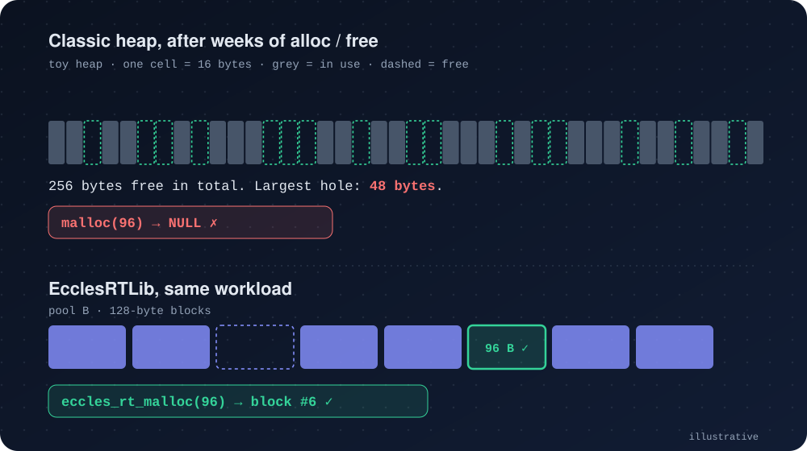
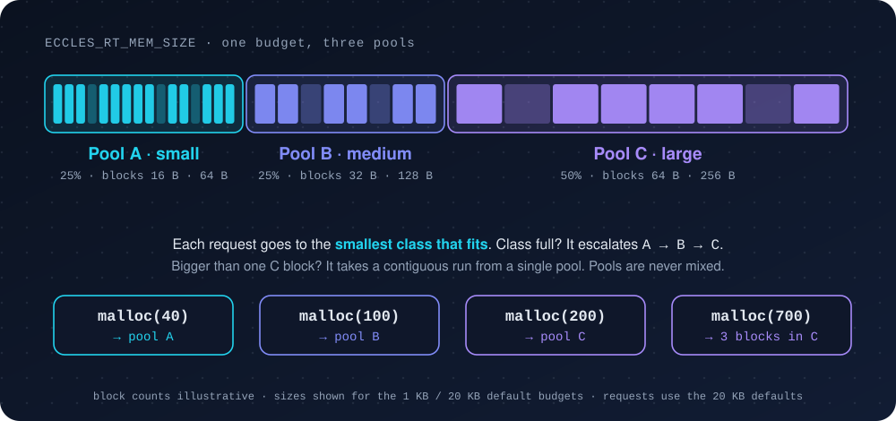

<div align="center">



<br>

[](https://github.com/igwe-starking/eccles-rtmem/actions/workflows/ci.yml)
[](LICENSE)
[](#)
[](#)
[](CHANGELOG.md)
[](https://github.com/sponsors/igwe-starking)

### `malloc()` works great — until hour 300, when your device quietly dies.

**EcclesRTLib** is a plain-C fixed-pool allocator for microcontrollers.
Same `malloc`/`free` shape. No heap fragmentation. No surprises.

<sub>Part of the **EcclesRTLib** family of embedded runtime libraries. This repo is the **RuntimeMemory** module (`eccles-rtmem`).</sub>

[**Quick start**](#-quick-start-30-seconds) · [**Platforms**](#-runs-where-you-do) · [**How it works**](#-how-it-works) · [**Docs**](docs/DESIGN.md) · [**Sponsor**](#-support-the-project)

</div>

---

## 😱 The bug you can't reproduce

Your firmware passes every bench test. Then it ships. Somewhere around day 12, a radio frame arrives and `malloc(96)` returns `NULL` — even though the heap reports **plenty of free memory**. It's just chopped into pieces too small to use.



That's heap fragmentation. On a desktop it's a rounding error. On a chip with 2 KB of RAM it's a **field failure you'll never see in a debugger.**

EcclesRTLib removes the failure mode instead of tuning around it:

- 🧱 **Memory is carved into fixed-size blocks up front.** Allocate, free, allocate again — the layout never degrades.
- 📏 **Sized for your chip, not a guess.** Give it your RAM size and it tiers the budget automatically; a curated lookup table already knows common 8-bit parts.
- 🔒 **The lock is picked for you.** FreeRTOS, Zephyr, CMSIS-RTOS2, Pico SDK (dual-core safe), AVR, MSP430, Cortex-M… detected at compile time.
- 🛡️ **Bad frees can't corrupt anything.** Double free, wild pointer, pointer into the middle of a buffer — all rejected *and told to you*, by name.
- 🧪 **Tested like it matters.** Randomized stress with per-buffer canary bytes, across 12 configurations, clean under AddressSanitizer and UBSan up to 2M operations.

## ⚡ Quick start (30 seconds)

Drop in `src/eccles_rtmem.c` and `src/eccles_rtmem.h`, then:

```c
#include "eccles_rtmem.h"

void setup(void) {
    eccles_rtmem_init();                    // once, at boot
}

void on_radio_frame(void) {
    uint8_t *buf = eccles_rt_malloc(96);    // same shape as malloc()
    if (buf) {
        /* ... parse the frame ... */
        eccles_rt_free(buf);                // and free()
    }
}
```

That's the whole integration. No linker scripts, no RTOS hooks, no build-system gymnastics. `eccles_rt_calloc`, `eccles_rt_realloc` and `eccles_rt_reset` are there too — see the [API reference](docs/DESIGN.md#api).

## 🕵️ Frees that talk back

A normal `free()` shrugs when you hand it garbage. This one tells you what you did wrong:

```c
switch (eccles_rt_free(ptr)) {
    case ECCLES_RT_FREE_OK:            break;             // freed
    case ECCLES_RT_FREE_ALREADY_FREE:  /* fix your logic */ break;
    case ECCLES_RT_FREE_MID_RUN:       /* pointer into the middle of a buffer */ break;
    case ECCLES_RT_FREE_OUT_OF_RANGE:  /* not ours at all */ break;
    case ECCLES_RT_FREE_MISALIGNED:    /* not on a block boundary */ break;
    default: break;
}
```

Ignore the return value and it behaves like the `free()` you already know. Turn on `ECCLES_RT_DEBUG` and every failed allocation and rejected free is logged — after the lock is released, never while it's held — with silence on the success path.

## 🔧 How it works

One memory budget, three pools of fixed-size blocks. Each request goes to the smallest class that fits, escalating upward if that class is full; requests bigger than one large block take a contiguous run from a single pool.



Everything is decided at compile time: pool sizes, block counts, bookkeeping. Block sizes should be powers of two, since the hot path then uses shifts instead of multiply/divide — real savings on an AVR with no hardware multiplier. A non-power-of-two size still works, just via plain division. Invalid configurations stop the build with a clear `#error`, not a runtime mystery.

## 📐 Sized for your chip, not a guess

Auto-detection now tiers the budget against your chip's *actual* RAM instead of a flat 1 KB / 20 KB split:

```c
#define ECCLES_RT_TOTAL_RAM_SIZE  8192ul   // your chip's real RAM, from the datasheet
```

| Your chip's RAM | Budget |
|---|---|
| < 4 KB | 50% of RAM |
| < 10 KB | 25% of RAM |
| < 100 KB | 10% of RAM |
| ≥ 100 KB | 5% of RAM |

A Mega2560 (8 KB RAM) now gets 2 KB instead of the same flat 1 KB as a 2 KB-RAM Uno. Classic 8-bit Arduino/LaunchPad chips don't even need `ECCLES_RT_TOTAL_RAM_SIZE` set — their compiler already hands over an exact-RAM macro (e.g. `__AVR_ATmega328P__`) that a built-in lookup table picks up automatically. Full table and the one known rough edge (a small non-monotonic step right at each tier boundary) are in [docs/DESIGN.md](docs/DESIGN.md#memory-budget).

## 🌍 Runs where you do

Auto-detected, zero config on the platforms below. Examples for each are in [`examples/`](examples).

| Platform | Locking (auto-selected) | Example |
|---|---|---|
| Arduino AVR (Uno, Nano, Mega…) | `cli()`/`sei()` with `SREG` save/restore | [`arduino_avr_blink_alloc`](examples/arduino_avr_blink_alloc) |
| Arduino ESP32 | FreeRTOS mutex | [`arduino_esp32_wifi_buffer`](examples/arduino_esp32_wifi_buffer) |
| ESP-IDF | FreeRTOS mutex | [`esp_idf_task`](examples/esp_idf_task) |
| STM32 + FreeRTOS (CubeMX) | CMSIS-RTOS2 mutex | [`stm32_freertos_cpp`](examples/stm32_freertos_cpp) |
| STM32 bare-metal | Cortex-M PRIMASK | [`stm32_bare_metal_cpp`](examples/stm32_bare_metal_cpp) |
| Raspberry Pi Pico (RP2040/RP2350) | `critical_section_t` (safe across both cores) | [`rp2040_pico_sdk_cpp`](examples/rp2040_pico_sdk_cpp) |
| nRF52 / Zephyr | `k_mutex` | [`zephyr_nrf52`](examples/zephyr_nrf52) |
| Arduino Nano 33 BLE (Mbed OS) | Cortex-M PRIMASK (swap in `rtos::Mutex` via the manual override) | [`mbed_nano33ble_cpp`](examples/mbed_nano33ble_cpp) |
| MSP430 | `__disable_interrupt()` with state save | [`msp430_cpp`](examples/msp430_cpp) |
| Single-thread super-loop | none (`ECCLES_RT_MEM_NO_LOCK`) | [`no_lock_superloop`](examples/no_lock_superloop) |
| Anything else with a C99 compiler | Cortex-M fallback, or no-op / your own hook | — |

Also detected: Microchip XC16/XC32 (dsPIC/PIC24/PIC32). STM8, 8-bit PIC and 8051 compile fine but fall back to no locking — plug in your own with the manual override. Works from C++ too: the header is wrapped in `extern "C"`.

## 📦 Install

<details open>
<summary><b>Any project</b></summary>

Copy `src/eccles_rtmem.c` and `src/eccles_rtmem.h` into your tree and add the `.c` to your build. Done.
</details>

<details>
<summary><b>Arduino</b></summary>

Download the repo as a ZIP and use **Sketch → Include Library → Add .ZIP Library**, or clone into your `libraries/` folder as `eccles-rtmem`. Then `#include <eccles_rtmem.h>`.
</details>

<details>
<summary><b>PlatformIO</b></summary>

```ini
lib_deps = https://github.com/igwe-starking/eccles-rtmem.git
```
</details>

<details>
<summary><b>ESP-IDF</b></summary>

Clone into your project's `components/` folder. The included `CMakeLists.txt` registers it as a component.
</details>

<details>
<summary><b>CMake</b></summary>

```cmake
add_subdirectory(eccles-rtmem)
target_link_libraries(my_firmware PRIVATE eccles::rtlib)
```
</details>

## 🎛️ Configure only what you care about

Defaults are sensible for prototyping. For anything you ship, **set the budget explicitly**:

```c
// via build flags:   -DECCLES_RT_MEM_SIZE=4096
// or copy config/eccles_rtmem_config.h next to your sources and uncomment:
#define ECCLES_RT_MEM_SIZE       4096ul
#define ECCLES_RT_BLOCK_A_SIZE   32ul
#define ECCLES_RT_BLOCK_B_SIZE   128ul
#define ECCLES_RT_BLOCK_C_SIZE   512ul
```

Every knob (pool split, alignment, heap-backed mode, the `MIN_WASTE` allocation strategy, custom locks, logging) is documented inline in [`config/eccles_rtmem_config.h`](config/eccles_rtmem_config.h) and in [docs/DESIGN.md](docs/DESIGN.md).

> ⚠️ Put settings in the config file or in build flags, not in a `#define` above your own `#include`. The library's `.c` file must see the same values as your code.

## ✅ Honest trade-offs

I'd rather you pick the right tool than be surprised later.

- **It's a bounded fixed-pool allocator, not a general `malloc()` replacement.** A 33-byte request in a 64-byte class wastes 31 bytes. That's the price of zero fragmentation.
- **Pools are independent.** A request can fail even when total free memory across all three pools would have been enough, and one allocation never spans two pools.
- **The RAM-tiered budget has a rough edge.** A chip with 4095 bytes of RAM computes ~50% (2048 B); one with exactly 4096 bytes computes only ~25% (1024 B) — the budget can drop as RAM goes up, right at each tier boundary. If your part sits near one, set `ECCLES_RT_MEM_SIZE` directly instead.
- **`MIN_WASTE` genuinely trades one failure mode for another.** It reduces bytes wasted on a single oversized request, at the cost of consuming a small pool's block capacity that frequent small allocations might have needed later. Neither default is universally correct — see the worked example in [docs/DESIGN.md](docs/DESIGN.md#allocation-strategy-for-oversized-multi-block-requests).
- **255-block cap** across A+B+C (compile-time checked). Plenty for typical MCU budgets; a wider registry is on the roadmap.
- **RTOS-mutex backends aren't ISR-safe** by default. Interrupt-masking backends (AVR, MSP430, Cortex-M…) are.
- **No formal worst-case timing has been measured on real hardware yet.** The design is bounded and deterministic; the numbers are on the roadmap.

## 🧪 Tests

```sh
make test       # 12 configurations: default, heap mode, NO_LOCK, MIN_WASTE, 1 KB,
                 # custom split, custom block sizes, near the 255-block cap,
                 # minimum 1-block pools, and 3 RAM-tiered detection scenarios
make sanitize    # the same matrix under AddressSanitizer + UndefinedBehaviorSanitizer
```

The suite includes 200,000-operation randomized stress runs where every live buffer carries a unique canary pattern that's re-verified before each free, plus `eccles_rt_get_stats()` invariant checks throughout. It's how a genuine out-of-bounds write and an incomplete alignment guarantee were both found and fixed — see the [changelog](CHANGELOG.md).

## 🚲 Where this came from

EcclesRTLib didn't start as a library. It started as one `.cpp` file — `RuntimeMemory.cpp` — written to keep a real ESP32 device off the heap: [**eccles-esp32-smart-bike**](https://github.com/Igwe-Starking/eccles-esp32-smart-bike), a smart e-bike platform handling real-time control, audio streaming, and Android communication on hardware that couldn't afford a fragmented heap mid-ride.

That original allocator only ever had to know one chip. This library is what happened when it had to learn about every chip — stripped of ESP-IDF/FreeRTOS specifics, given eight more locking backends, and rebuilt in plain C99 so the same design could run on an ATtiny as easily as an ESP32. The function names changed (`e_malloc` → `eccles_rt_malloc`, and friends — the old ones still work as aliases), but the core idea, and the block-pool design itself, is exactly what shipped on that bike.

<sub>Curious what an allocator looks like before it's had to be polite to nine other platforms? <a href="https://github.com/Igwe-Starking/eccles-esp32-smart-bike/blob/main/firmware/source/components/eccles/src/RuntimeMemory.cpp">Read the original</a>.</sub>

## 🗺️ Roadmap

- [ ] Fragmentation stats (largest free run) and failure counters in `eccles_rt_get_stats()`
- [ ] Optional 16-bit registry for configurations needing more than 255 blocks
- [ ] Optional cross-pool allocation for oversized requests
- [ ] Measured worst-case timing on real hardware (AVR, Cortex-M0/M4, ESP32)
- [ ] Hardware-verified locking backends for STM8, 8-bit PIC and 8051
- [ ] Multi-instance support (independent allocator handles instead of one global pool)

Want one of these? [Open an issue](../../issues) or a PR — see [CONTRIBUTING.md](CONTRIBUTING.md).

## 💖 Support the project

EcclesRTLib is free, MIT-licensed, and built in spare hours. If it saved you from a 3 a.m. field failure, or you just like seeing embedded tooling done carefully, consider sponsoring — it directly funds hardware for testing more chips and toolchains.

<div align="center">

[**♥ Sponsor on GitHub**](https://github.com/sponsors/igwe-starking)

</div>

Can't sponsor? A ⭐ on the repo and telling one embedded developer who's fighting heap fragmentation helps just as much.

## 🤝 Contributing

Bug reports, new platform backends, and hardware-verified results are especially welcome. Read [CONTRIBUTING.md](CONTRIBUTING.md), and please follow the [Code of Conduct](CODE_OF_CONDUCT.md). Security issues: see [SECURITY.md](SECURITY.md).

## 📄 License

[MIT](LICENSE) — use it in hobby projects and products alike.
